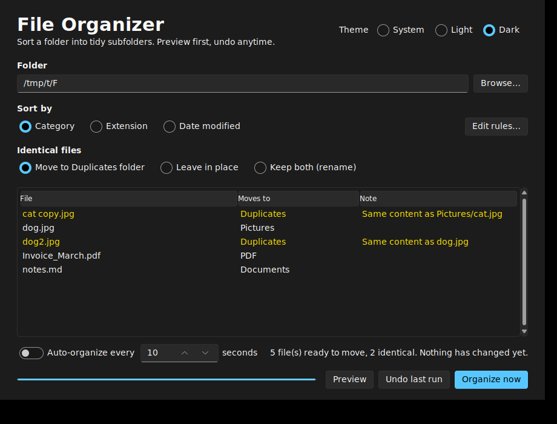
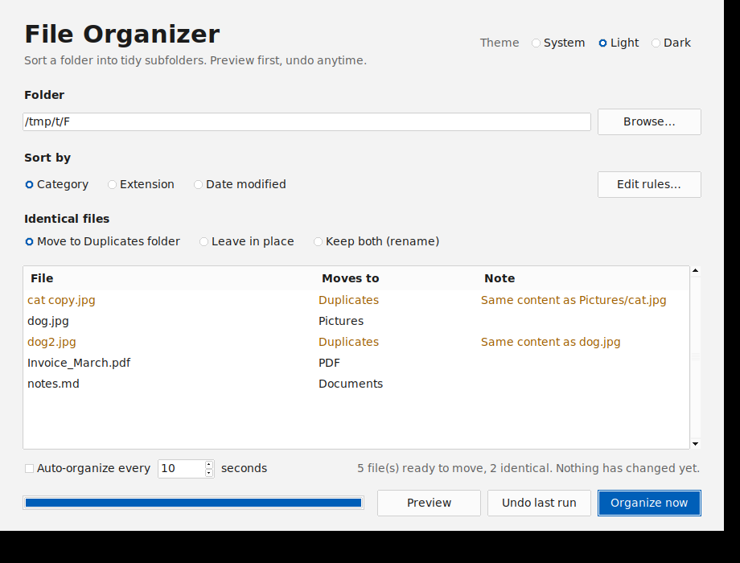
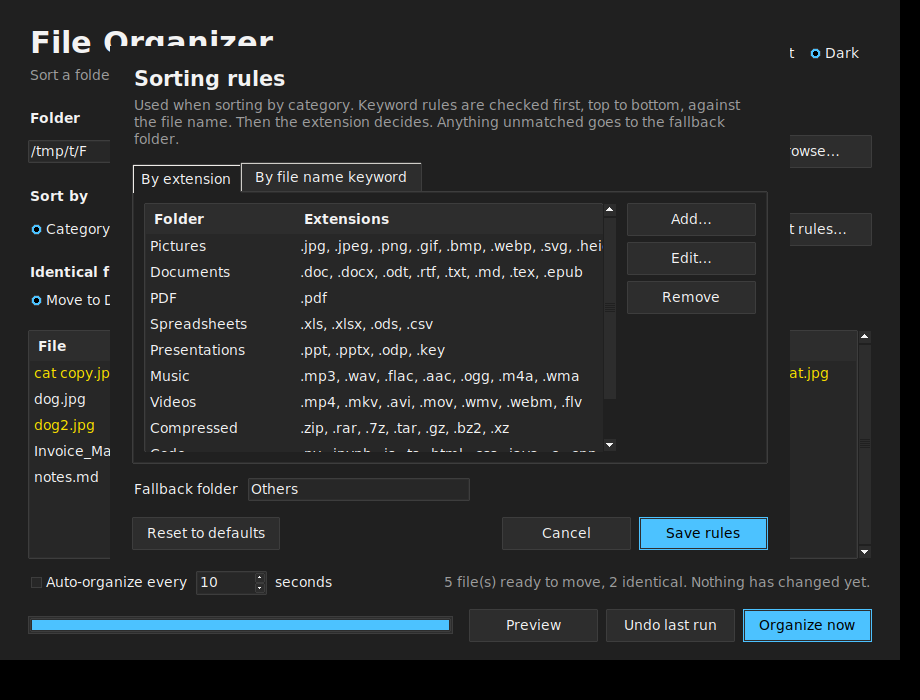

# File Organizer

A small desktop app that tidies a messy folder (like Downloads) by sorting its files into subfolders by category, extension, or date. You can preview every move before it happens and undo it afterwards.

Built with Python and Tkinter, in a single file with no required dependencies.



## Features

- **Preview first.** See exactly where each file will go before anything moves.
- **Three ways to sort.** By category (Pictures, Documents, Music, …), by extension (PDF, JPG, …), or by date modified (`2026/09`).
- **Duplicate detection.** Files whose content already exists in the destination folder are found by comparing file size and a SHA-256 hash. You choose what happens to them: move them to a `Duplicates` folder, leave them in place, or keep both.
- **Custom rules, no coding needed.** Edit which extensions go to which folder, and add file name keyword rules (for example, anything containing "invoice" goes to `Finance`).
- **Undo.** Reverse the last run with one click. Folders the app created are removed again if they end up empty.
- **Safe moves.** Existing files are never overwritten; name clashes become `photo (1).jpg`, `photo (2).jpg`, and so on.
- **Auto-organize.** Optionally re-checks the folder every N seconds and sorts new files as they arrive.
- **Light, dark, or system theme.** System follows your OS setting while the app is open. Dark mode works with or without the optional theme package.
- **Remembers your settings.** Folder, sort mode, duplicate handling, theme, and window size are restored next time.
- **Skips what it shouldn't touch.** Hidden files, subfolders, and unfinished downloads (`.crdownload`, `.part`, `.partial`, `.tmp`, `.download`) are left alone.

| Light theme | Sorting rules editor |
| --- | --- |
|  |  |

## Installation

You need **Python 3.8 or newer**.

```bash
git clone https://github.com/<your-username>/<your-repo>.git
cd <your-repo>
```

Optional, but recommended on Windows for the Windows 11 look and automatic theme detection:

```bash
pip install -r requirements.txt
```

This installs [`sv-ttk`](https://github.com/rdbende/Sun-Valley-ttk-theme) and [`darkdetect`](https://github.com/albertosottile/darkdetect). Without them the app uses its built-in light and dark themes.

On Debian or Ubuntu Linux, Tkinter may need to be installed separately:

```bash
sudo apt install python3-tk
```

## Usage

```bash
python file_organizer.py
```

1. Choose a folder with **Browse…**.
2. Pick how to sort: **Category**, **Extension**, or **Date modified**.
3. Pick what to do with **identical files**.
4. Select **Preview** to see where each file will go. Nothing changes yet.
5. Select **Organize now** and confirm.
6. Changed your mind? Select **Undo last run**.

To keep a folder tidy automatically, turn on **Auto-organize every … seconds** (minimum 5). Files modified in the last 5 seconds are skipped, so downloads that are still being written aren't moved mid-transfer.

## How it works

### Sorting modes

| Mode | Example result |
| --- | --- |
| Category | `report.pdf` → `PDF/`, `song.mp3` → `Music/`, unknown types → `Others/` |
| Extension | `report.pdf` → `PDF/`, files without an extension → `NO_EXTENSION/` |
| Date modified | `report.pdf` modified in September 2026 → `2026/09/` |

Only files directly inside the chosen folder are sorted. Files already inside subfolders are not touched.

### Duplicate detection

When a file is about to move into a folder, the app checks whether a file with the same content is already there, or is heading there earlier in the same run. Sizes are compared first, and only files of equal size are hashed with SHA-256, so large folders stay fast. Empty (0-byte) files are never treated as duplicates.

The check covers the destination folder only. It does not search your whole drive, and it does not compare against files in other subfolders.

| Option | What happens to an identical file |
| --- | --- |
| Move to Duplicates folder (default) | Moved to `Duplicates/`, where you can review and delete it |
| Leave in place | Stays where it is |
| Keep both (rename) | Moved like any other file and renamed if needed, e.g. `photo (1).jpg` |

### Sorting rules

Select **Edit rules…** to change how Category mode sorts files:

- **By extension:** which extensions belong to which folder. Each extension can belong to only one folder.
- **By file name keyword:** if a file name (without its extension) contains the keyword, it goes to that folder. Keywords are not case-sensitive and are checked top to bottom before extensions; the first match wins.
- **Fallback folder:** where everything else goes (default `Others`).

Rules are saved as `rules.json` in the settings folder (see below). The default rules are defined in `DEFAULT_CATEGORIES` near the top of `file_organizer.py`, and **Reset to defaults** in the editor restores them.

Example `rules.json`:

```json
{
  "categories": {
    "Pictures": [".jpg", ".png", ".webp"],
    "PDF": [".pdf"]
  },
  "keywords": [
    { "keyword": "invoice", "folder": "Finance" }
  ],
  "other_folder": "Others"
}
```

### Undo

Each run is recorded in a hidden file, `.file_organizer_undo.json`, inside the organized folder. It keeps the last 20 runs, and **Undo last run** reverses the most recent one. If a file was moved or deleted after organizing, undo skips it and tells you which files it couldn't restore.

### Where settings are stored

| System | Location |
| --- | --- |
| Windows | `%APPDATA%\FileOrganizer\` |
| macOS | `~/Library/Application Support/FileOrganizer/` |
| Linux | `$XDG_CONFIG_HOME/file_organizer/` (usually `~/.config/file_organizer/`) |

Delete that folder to reset the app to its defaults.

## Platform notes

The app is designed with Windows 10/11 in mind: dark title bars, high-DPI support, and reading the system theme from the Windows registry are Windows-only extras. The core app uses standard Tkinter and has been run on Linux. It has not been tested on macOS.

Standard pop-ups (confirmations, warnings) and the folder picker are drawn by the operating system, so they follow the OS look rather than the app's theme.

## Project structure

```
file_organizer.py   the whole app: core sorting logic first, GUI below it
requirements.txt    optional packages for the Windows 11 look
docs/               screenshots used in this README
```

The sorting, duplicate, and undo functions (`build_plan`, `organize`, `undo_last_run`) contain no GUI code, so they can be imported and tested on their own.

## Contributing

Issues and pull requests are welcome. If you report a bug, please include your operating system, Python version, and whether `sv-ttk` is installed.

## License

<!-- Choose a license before publishing, e.g. MIT: https://choosealicense.com/licenses/mit/ -->
This project is licensed under the [LICENSE NAME] — see the [LICENSE](LICENSE) file for details.
